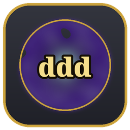

<div align="center">



# Kingsmerchant

**A fast, native Path of Exile 2 price-check overlay for Linux.**
Built for KDE Plasma 6 on Wayland — no Electron, no browser, no stolen focus.

[](https://github.com/webtemp/Kingsmerchant/actions/workflows/ci.yml)
[](#license)


<!-- DEMO GIF — record a short loop (hover item → Ctrl+C → popup with listings)
     and drop it at assets/demo.gif. See "Capturing the visuals" below. -->


</div>

---

Hover an item in game, press **Ctrl+C**, and a translucent popup shows the
median asking price and the cheapest live listings — each with one-click
**Whisper / Invite / Hideout / Trade** actions. POE2 keeps keyboard focus the
whole time, and the overlay stays hidden until your first copy.

## ✨ Features

- ⚡ **Instant price check** — Ctrl+C on a hovered item shows the median price
  and cheapest listings, sampled live from the official trade API.
- 🖱️ **One-click trade actions** — Whisper, Invite, Hideout, and Trade per
  listing (copied to your clipboard, since Wayland blocks typing into POE2).
  Instant-Buyout listings also get **Teleport to hideout** when a `POESESSID`
  is set.
- 🎚️ **Detailed stat filters** — a live panel with a toggle per mod, per-mod
  minimum rolls, price range, rarity/resistance handling, and misc flags. Edits
  re-run the search automatically.
- 💱 **Bulk currency exchange** — stackables are priced through the bulk
  exchange, backed by poe2scout with the official exchange as fallback.
- 🤖 **ML price estimate** — a poeprices.info machine-learning badge for rares,
  alongside the live-listings median.
- 🎨 **Theme manager** — accent colours + popup opacity from Settings or
  `config.json`, with four built-in presets (Default Gold, Minimal Slate,
  Crimson Ember, Arcane Violet).
- 🔨 **Craft of Exile link** — open the current item in the
  [Craft of Exile](https://www.craftofexile.com/?game=poe2) simulator.
- 🔗 **Open on trade site** — deep-link the exact search, every filter included.
- 🏆 **League aware** — auto-resolves the current league at startup; pin one
  from the selector and it follows rollovers until you pick.
- 🪶 **Native & lightweight** — a small Rust binary on a focus-less
  `wlr-layer-shell` surface. Takes no keyboard focus, hidden until first copy.

## 📸 Screenshots

<!-- Drop the stills here. Hero still = the price popup over POE2; settings =
     the theme panel or a couple of presets. See "Capturing the visuals". -->
<table>
  <tr>
    <td align="center"><br/><sub>Live price check</sub></td>
    <td align="center"><br/><sub>Settings &amp; themes</sub></td>
  </tr>
</table>

## ⚡ Install

### Arch Linux

A PKGBUILD ships in [`packaging/arch`](packaging/arch); see
[`assets/INSTALL.md`](assets/INSTALL.md) for the full walkthrough.

### From source

```sh
cargo run --release
```

`cargo run` launches the overlay (the `kingsmerchant` binary is the workspace
default). Alt-tab into POE2, hover an item, and press **Ctrl+C**.

`POE_LEAGUE` / `POE_REALM` override the configured league/realm for a single
run; `RUST_LOG=debug` turns on detailed logging.

### Requirements

- Linux with **KDE Plasma 6 on Wayland** (uses `wlr-layer-shell`).
- **`xclip`** + **`xdotool`** and a running **XWayland** (always present while a
  Proton game runs). `xclip` reads POE2's clipboard; `xdotool` detects the
  focused POE2 window. Without `xdotool` the Ctrl+C gate never fires.
- **`xdg-utils`** (`xdg-open`) for the trade-site / Craft of Exile links.
- Membership in the **`input`** group (see below).
- The Rust toolchain (**1.96+**) to build from source.

> [!IMPORTANT]
> **Input access is required.** Both the global **Ctrl+C** hotkey (evdev read)
> and chat injection for the Whisper/Invite buttons (uinput write) need your
> user in the `input` group:
>
> ```sh
> sudo usermod -aG input "$USER"   # then log out and back in
> ```
>
> Without this the hotkey **silently does nothing** — no error, no popup. This
> is the #1 "it doesn't work" cause.

## ⌨️ Usage

| Hotkey            | Action                                             |
| ----------------- | -------------------------------------------------- |
| **Ctrl+C**        | Price-check the hovered item (opens the popup)     |
| **F5**            | Run the hideout chat macro (`/hideout` by default) |
| **F2**            | Run the second chat macro (`/exit` by default)     |
| **Escape**        | Close the popup                                    |
| **Ctrl+Alt+drag** | Move the popup; where you drop it is remembered    |

All hotkeys are rebindable in **Settings** (the gear icon, or the tray menu).
By default they only fire while POE2 is focused, so Ctrl+C elsewhere isn't
hijacked.

## ⚙️ Configuration

Settings live at `~/.config/kingsmerchant/config.json` (honouring
`XDG_CONFIG_HOME`). Seeded on first run, editable from the in-app Settings
panel, and **hot-reloaded** on disk change — hand edits apply live.

<details>
<summary><b>Notable config fields</b></summary>

| Field                      | Meaning                                                       |
| -------------------------- | ------------------------------------------------------------ |
| `league` / `league_pinned` | Trade league; empty + unpinned = auto-resolve at startup     |
| `trade_status`             | Which listings to search (`securable` / `online` / …)        |
| `filter_min_percent`       | How tightly per-mod filter minimums are seeded from the roll |
| `hotkey_*`                 | Rebindable hotkeys (e.g. `"Ctrl+C"`, `"F5"`, `"Escape"`)     |
| `poesessid`                | Trade-site session cookie — only for the Teleport button     |
| `theme`                    | Accent colours + popup opacity (see below)                   |

</details>

<details>
<summary><b>Theme block</b></summary>

The `theme` block holds `#rrggbb` accent colours and an `opacity` (`0.0`–`1.0`,
lower = more see-through to the game). Defaults reproduce the original look; the
rarity/frame colours are fixed because they mirror the in-game item colours.

```jsonc
"theme": {
  "accent_gold":    "#e6c25a",  // headline price / accents
  "affix_blue":     "#8a8af0",  // rolled-mod text
  "online_dot":     "#4cd137",  // online / valid indicator
  "header_bg":      "#17171c",  // inset item cards
  "overlay_fill":   "#2c2e36",  // popup background
  "overlay_stroke": "#50525e",  // popup border
  "opacity": 1.0
}
```

</details>

## 🧩 Under the hood

<details>
<summary><b>Platform notes</b></summary>

- **Hotkeys** read `/dev/input/by-id/*-event-kbd` directly via evdev — there is
  no usable compositor global-shortcut path for an XWayland-targeted overlay on
  KDE Wayland. Requires the `input` group.
- **Clipboard** reads the **X11** CLIPBOARD selection directly (via `xclip`).
  POE2 runs under Proton, so it is an X11/XWayland client; reading the same
  XWayland server is the most direct path and avoids KWin's flaky X11↔Wayland
  bridge.
- **Never write the clipboard while testing.** The app only reads, deliberately:
  any process that takes clipboard *ownership* (`wl-copy`, `xclip -i`, a
  clipboard manager) fights KWin's XWayland sync and makes POE2's copies read
  stale/empty. Test with a real in-game copy.

</details>

<details>
<summary><b>Architecture</b></summary>

A Cargo workspace split into focused crates, each unit-tested in isolation:

| Crate                   | Responsibility                                                              |
| ----------------------- | -------------------------------------------------------------------------- |
| `app`                   | The `kingsmerchant` binary — a thin entry point that launches the overlay. |
| `crates/parser`         | Parse POE2's "Copy Item" clipboard text into a structured `Item`.          |
| `crates/trade-api`      | Price an `Item` against the official trade API (search/fetch, bulk exchange, rate-limit gating, poeprices.info estimates) over a mockable HTTP seam. |
| `crates/ui`             | The egui price-check view + app logic, windowing-agnostic.                 |
| `crates/overlay`        | Drives the `ui` on focus-less `wlr-layer-shell` surfaces (popup + settings). |
| `crates/platform-linux` | Linux glue: evdev hotkeys, X11 clipboard, uinput chat injection, tray.     |

The network and OS boundaries sit behind traits, so the parsing, query-building,
and rate-limit logic are exercised by the test suite without touching the
network or a real Wayland session.

</details>

<details>
<summary><b>Development</b></summary>

```sh
cargo test --workspace                                  # run the full suite
cargo clippy --workspace --all-targets -- -D warnings   # lint
cargo fmt --all                                         # format
```

For a tight edit loop, keep a watcher running in one terminal and code in
another — it re-lints and relaunches the overlay on every save:

```sh
cargo install cargo-watch     # once
cargo watch -x clippy -x run  # lint, then run, on each change
```

CI runs fmt, clippy (`-D warnings`), tests, doc, and an MSRV check on every push
and pull request.

</details>

## Disclaimer

Kingsmerchant is an unofficial, fan-made tool. It is not affiliated with,
endorsed by, or associated with Grinding Gear Games. Path of Exile is a
trademark of Grinding Gear Games.

## License

Licensed under either of [MIT](LICENSE-MIT) or
[GPL-3.0-or-later](LICENSE-GPL) at your option.
